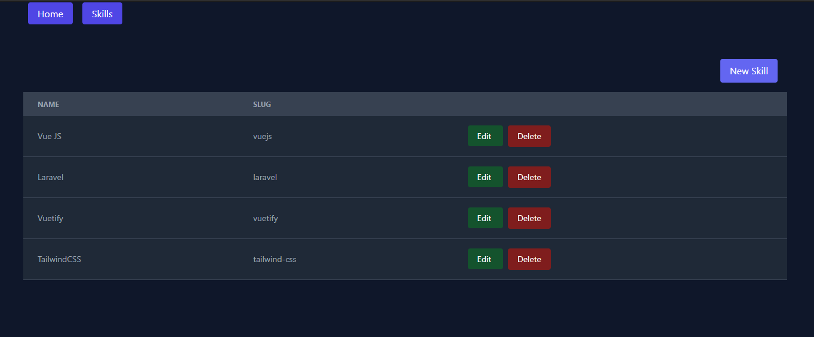

# vue-rest-api

dashboard CRUD using Vue with Vite and consuming API made with Laravel. 

you can see the API code [here](https://github.com/becardine/rest-api)


## screenshot


## Project Setup

```sh
npm install
```

### Compile and Hot-Reload for Development

```sh
npm run dev
```

### Compile and Minify for Production

```sh
npm run build
```
